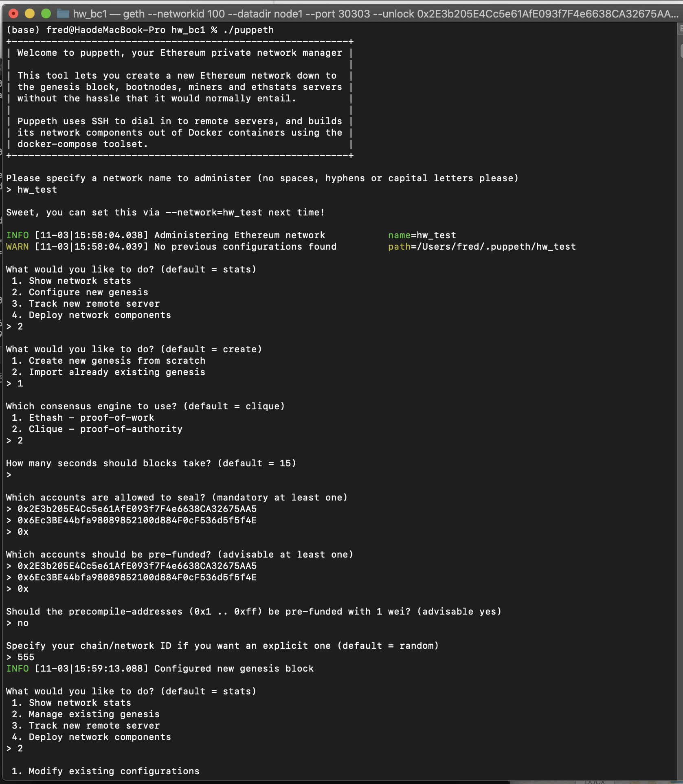

# Homework Blockchain

# 1. Steps illustration
### 1.1   Nodes development
Node 1

    Code: ./geth account new --datadir node1
 Node 2

    Code: ./geth account new --datadir node2
### 1.2 Configure new genesis
    
    Code: ./puppeth
    Note: Choose the Clique (Proof of Authority) consensus algorithm.

### 1.3 Initialize nodes
Node 1

    Code: ./geth init puppernet.json --datadir node1
Node 2

    Code: ./geth init puppernet.json --datadir node2 

### 1.4 Mining setup
Node 1

    Code: ./geth --networkid 100 --datadir node1 --port 30303  --unlock "0x2E3b205E4Cc5e61AfE093f7F4e6638CA32675AA5" --mine --http --miner.threads 1 --allow-insecure-unlock

- > The `--networkid` flag is Network identifier (integer,  `1=Frontier`, `3=Ropsten`, `4=Rinkeby`, `5=Görli`) (default: 1)\
- >The `--port` flag is network listening port (default: `30303`)\
- >The `--mine` flag is to enable mining.\
- >The `--http` flag is to enable the HTTP-RPC server.\
- >The `--minerthreads` flag is set to at least 1 on the first node.\
- >The `--allow-insecure-unlock` flag is to allow insecure account unlocking when account-related RPCs are exposed by http.

Node 2 

    Code: ./geth --networkid 100 --datadir node2 --unlock "0x6Ec3BE44bfa98089852100d884F0cF536d5f5f4E" --mine --port 30311 --bootnodes " enode://9f906eaa1414128c83596cda45d02bd692400a8865b90fcfb7777caf6193fa43dcd5671f0dd8f1afbd70054b8b9583c28c30139028df56960a80e6c6d6ac582d@127.0.0.1:30303"

- >The `enode:// address` of the first node is copied into the second node's --bootnodes flag in quotes.\
- >The `--port` flag is Network listening port (default: 30303)\
The default sync port is `30303`, so set `30311` for the second node.\
- >

# 2. Screenshot Displaying

**2.1 Configuration screenshot**

- > Network name is hw_test.
- > Consensus engine is proof-of-authority.
- > Chain\network is 555.

**2.2 Mining Terminal**

**2.3 Account Balance**

**2.4 Transaction Summary**

